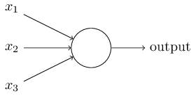

# Neural Networks

### To Summarise:

Neural networks are *hard* to understand!

### What are they?

They're a biologically inspired way for a computer to make predictions, based on a training set of data. They're basically just more complicated versions of what we've been doing all week. 
But they are MUCH more complicated.

You're probably used to seeing pictures like this. But what do they mean?

Each point is called a neuron. In many ways, they're more complicated than a biological neuron, which is either on, or off, whereas most artificial neurons can have a value on a continuous scale between 1 and 0. 
I'll explain a very simple type of artificial neuron to give you an idea of what they do first of all. 

### The Perceptron. 

Sounds cool. 

A perceptron will take in several binary inputs, and produce a single binary output. 

The perceptron will have a weight associated with it, which is basically just a number that you multiply the sum of the inputs by. If this weighted sum passes a threshold, the perceptron will output 1, if it doesn't, it'll output 0. 
A way to think about it could be that a perceptron is something that will make decisions based on evidence.

To steal Michael Nielsen's example, imagine you're trying to decide whether or not to go to a cheese festival at the weekend. There are three main factors influencing your decision: 
* whether the weather will be good
* whether your partner will go with you
* whether the festival is near public transport

Now maybe you absolutely _love_ cheese, and you don't care whether your partner is going or not, or whether the festival is near public transport. But actually, you really _**HATE**_ bad weather, and if it's not nice, you won't go. One way to do this with the perceptron is to have a weighting of 6 for the weather, and a weighting of 2 for each of the other inputs. Now, say we set a threshold of 5. 

* The weather is good ( 1 * 6 = 6)
* Your partner doesn't want to go (0 * 2 = 0)
* The festival is near public transport (1 * 2 = 2)

* The total is 8, the threshold is passed, the perceptron output is 1, and you get to go to the festival! Yay!

You can see that by varying the weights and the threshold, we can get different outcomes. You can also see that a network of perceptrons could be capable of complex decision making. 

Now, training your network basically just means tweaking the weights and thresholds of all of these perceptrons, which your network will do all by itself until it predicts the training data correctly. It does this with all sorts of complicated linear algebra, valleys and gradients and necessary 3D graphs.

This is obviously a very *very* simplified version, but it does explain the basic principle of a neural network. 

